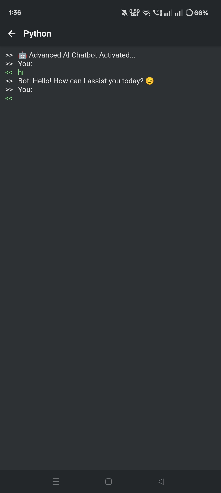

# 🤖 Advanced AI Chatbot

This is a Python-based AI chatbot that simulates intelligent conversation using rule-based logic and dynamic responses.

---

## 🚀 Features
- Smart conversational responses  
- Study & productivity tips  
- Time-based interaction system  
- Simple AI logic chatbot design  

---

## 🛠 Tech Used
- Python  

---

## 🎯 Project Goal
This project is built to understand AI logic systems, improve Python programming skills, and simulate a basic intelligent assistant.

---

## ▶️ How to Run
1. Download the file `advanced_ai_chatbot.py`  
2. Open terminal or Acode/Python environment  
3. Run command:

## 📸 Project Screenshot

